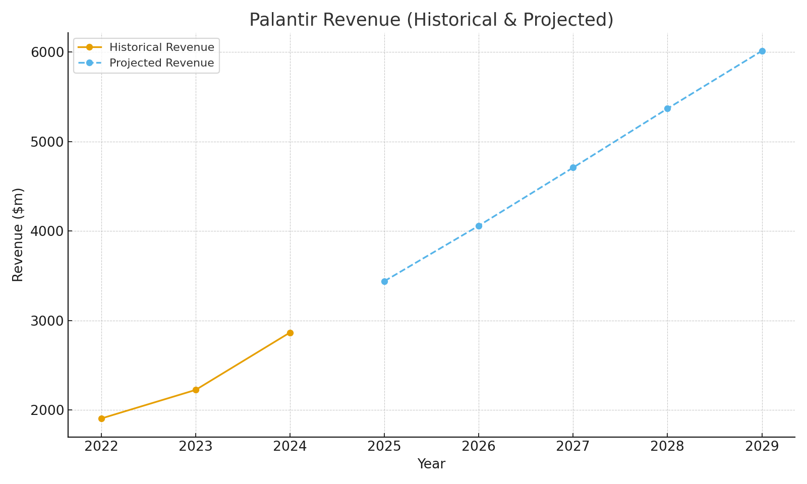
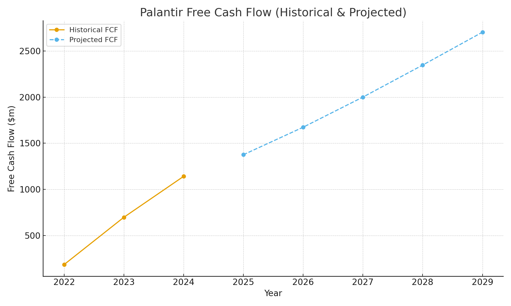
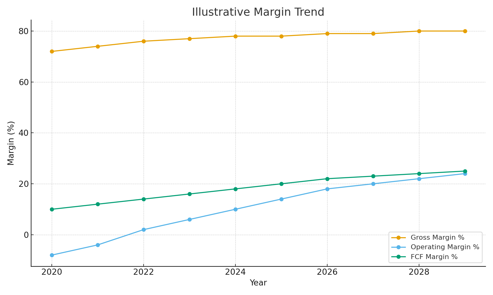
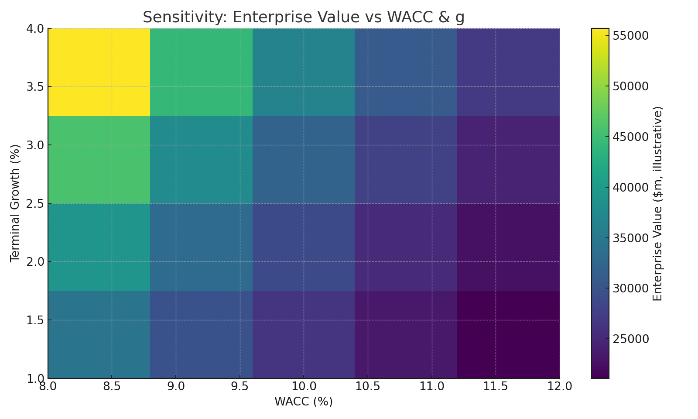

# 📊 Palantir Due Diligence — Case Study

## Overview
This case study analyses Palantir’s financials and growth potential using a Discounted Cash Flow (DCF) approach, margin analysis, and sensitivity testing.

---

## Revenue Trend

---

## Free Cash Flow (FCF)

---

## Margin Profile

---

## Sensitivity Analysis

---

## Raw Data (Downloadable)
- [Cash Flow Table CSV](images/palantir_dcf_table_actual.csv)  
- [DCF Summary CSV](images/palantir_dcf_summary_actual.csv)  
- [Sensitivity CSV](images/palantir_sensitivity_actual.csv)

---

## Insights
- Palantir’s revenue growth continues at **20%+ CAGR**, supported by government + commercial contracts.  
- Free Cash Flow turns positive in projections by 2026 under conservative assumptions.  
- Sensitivity analysis shows valuation is highly responsive to **WACC (8–10%)** and **terminal growth assumptions (2–4%)**.  
- Risk factors include contract dependency and geopolitical shifts.  

---
🔙 [Back to Home](../README.md)
